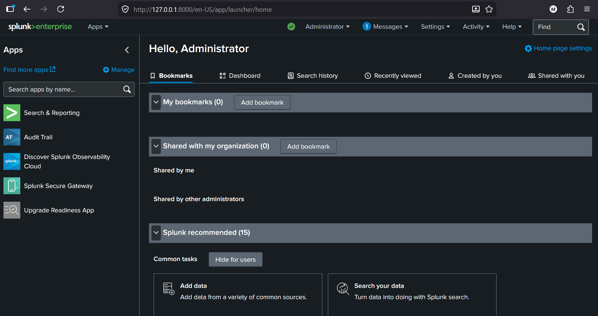
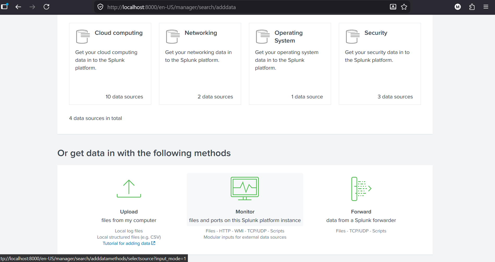
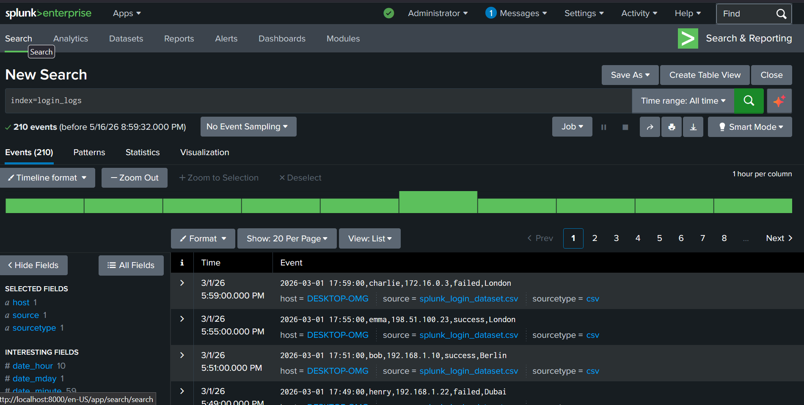
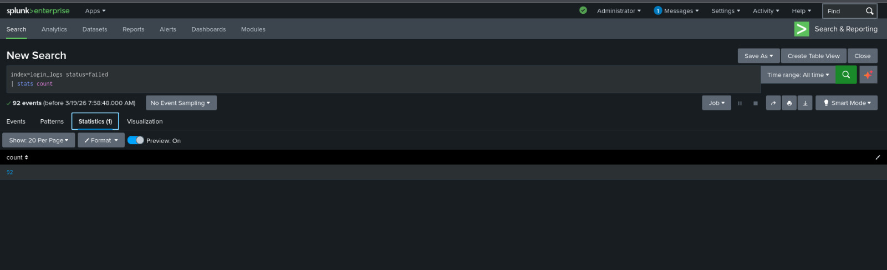
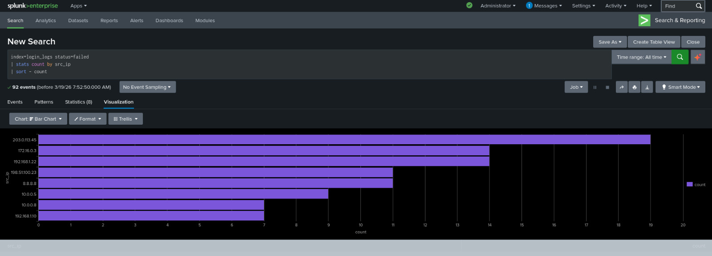
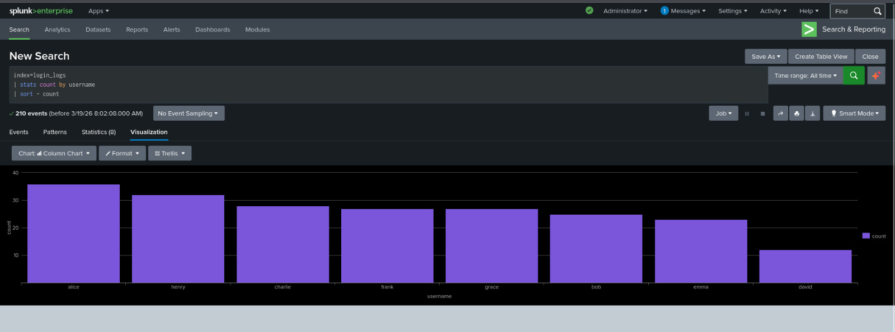
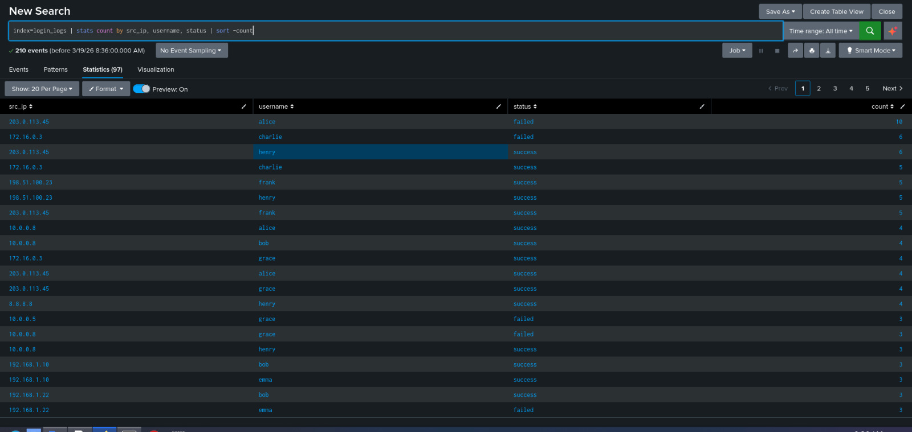

# Authentication Log Analysis Using Splunk Enterprise

## Project Background

This project was assigned as part of a cybersecurity community practical exercise focused on Security Operations Center (SOC) workflows and log analysis using Splunk Enterprise.

The goal of the exercise was to introduce students to:
- log ingestion
- event monitoring
- authentication analysis
- suspicious activity detection
- incident investigation using SPL queries

The dataset provided contained both successful and failed authentication attempts.

---

# Original Task Given

> Today, we are starting our first project using Splunk Enterprise.
>
> This project introduces log analysis and incident detection, which are key responsibilities of SOC analysts. In real cybersecurity environments, analysts spend a lot of time reviewing logs to identify suspicious activities.
>
> A dataset containing successful and failed login attempts was provided. The task was to import the dataset into Splunk and investigate the following:
>
> - Number of failed login attempts
> - IP address with the highest failed logins
> - Username appearing most frequently
> - Any suspicious authentication patterns
>
> The purpose of the project was to develop foundational log analysis and investigation skills using Splunk.

---

# Objective

To analyze authentication logs using Splunk in order to identify failed login attempts, suspicious IP addresses, targeted usernames, and possible brute-force attack indicators within a controlled lab environment.

---

# Scope

- Environment: Local Lab Environment
- Data Source: Authentication Log CSV Dataset
- Focus Areas:
  - Failed login monitoring
  - Authentication analysis
  - Suspicious IP investigation
  - Username activity monitoring
  - Incident detection

---

# Tools Used

- Splunk Enterprise
- CSV Authentication Dataset
- SPL (Search Processing Language)

---

# Methodology

The assessment followed a structured process:

1. Import authentication logs into Splunk  
2. Verify indexed events  
3. Search and filter authentication activity  
4. Analyze failed login attempts  
5. Identify suspicious IP addresses  
6. Investigate username activity  
7. Detect suspicious authentication patterns  

---

# 1. Splunk Environment Setup

## Purpose

To configure and access the Splunk environment for log ingestion and security monitoring.

### Output



---

# 2. Dataset Upload

## Purpose

To import the provided authentication log dataset into Splunk for analysis.

### Output



---

# 3. Log Verification

## Purpose

To confirm that authentication logs were successfully indexed and searchable.

### SPL Query Used

```spl
index=login_logs
````

### Output



---

# 4. Failed Login Attempt Analysis

## Purpose

To identify and count failed authentication attempts within the dataset.

### SPL Query Used

```spl
index=login_logs status=failed | stats count
```

### Result

```plaintext
92 failed login attempts detected
```

### Output



---

# 5. Suspicious IP Address Investigation

## Purpose

To identify IP addresses responsible for the highest number of failed login attempts.

### SPL Query Used

```spl
index=login_logs status=failed | stats count by src_ip | sort - count
```

### Result

```plaintext
203.0.113.45 generated the highest failed login attempts
```

### Analysis

The repeated failed authentication attempts from a single IP may indicate brute-force or credential-stuffing activity.

### Output



---

# 6. Username Activity Analysis

## Purpose

To identify usernames appearing most frequently within authentication events.

### SPL Query Used

```spl
index=login_logs | stats count by username | sort - count
```

### Result

```plaintext
ALICE appeared 36 times
```

### Analysis

The repeated appearance of the same username may indicate targeted authentication attempts against a specific user account.

### Output



---

# 7. Suspicious Activity Detection

## Purpose

To identify suspicious authentication patterns and repeated failed login attempts.

### SPL Query Used

```spl
index=login_logs status=failed | stats count by src_ip, username | sort - count
```

### Findings

The investigation identified:

* repeated failed login attempts from the same IP address
* multiple usernames targeted from one source IP
* repeated authentication failures against specific accounts

These patterns may indicate brute-force or unauthorized access attempts.

### Output



---

# Key Findings

* 92 failed login attempts were detected
* IP address 203.0.113.45 generated the highest number of failed logins
* The username ALICE appeared most frequently
* Multiple suspicious authentication patterns were identified
* Authentication activity suggested possible brute-force behavior

---

# Risk Analysis

Unmonitored authentication activity may expose organizations to:

* brute-force attacks
* unauthorized access attempts
* credential stuffing attacks
* account compromise
* privilege escalation risks

---

# Recommendations

* Monitor or temporarily block suspicious IP addresses
* Review authentication attempts targeting sensitive accounts
* Implement strong password policies
* Enable multi-factor authentication (MFA)
* Configure Splunk alerts for repeated failed logins
* Continuously monitor authentication logs

---

# Conclusion

This project demonstrates how Splunk can be used to analyze authentication logs, investigate failed login attempts, identify suspicious IP activity, and detect potential brute-force attack behavior using SPL queries and log correlation techniques.

The exercise provided practical exposure to SOC analyst workflows, log investigation processes, and security event monitoring within a controlled lab environment.

---

# Disclaimer

All activities, datasets, analyses, and investigations demonstrated in this repository were conducted in a controlled educational environment for ethical and learning purposes only. No unauthorized systems or production environments were targeted or accessed.

```
```
